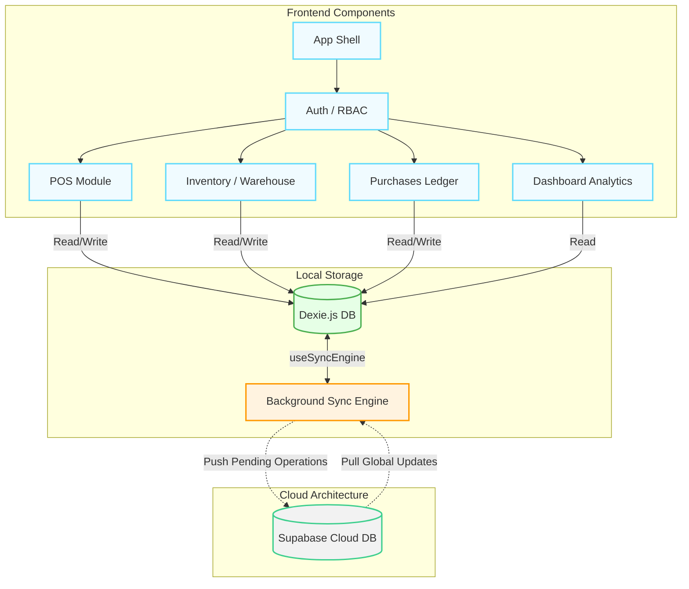

# Omni-Shop ERP: System Architecture Document

## System Overview
Omni-Shop is designed with a resilient **Offline-First** architecture to ensure uninterrupted retail and warehouse operations regardless of internet connectivity. It utilizes a local-first approach where all reads and writes happen directly against an embedded, in-browser database. A background synchronization engine continuously monitors network state and seamlessly handles the bidirectional data exchange between the local database and the central cloud database when connectivity is available.

## Tech Stack
The application is built using the following core technologies:
* **React**: Frontend UI library for building modular component-based interfaces.
* **Vite**: Ultra-fast build tool and development server.
* **Tailwind CSS**: Utility-first CSS framework for modular, highly-responsive UI designs.
* **Dexie.js**: A robust wrapper for IndexedDB, providing local offline database capabilities.
* **Supabase**: Open-source alternative to Firebase serving as the cloud backend, providing a centralized PostgreSQL database and authentication.

## Data Flow
The data flow strictly enforces an offline-first paradigm to ensure zero-latency UI interactions:
1. **User Interface (`UI`)**: Staff perform actions (sales, inventory audits, purchases) via React components effortlessly.
2. **Local Dexie Database (`Local DB`)**: Data is immediately read from and written to the local Dexie.js database (`OmniShopDB`), ensuring instant feedback and robust offline capabilities. Changes (e.g., purchases, inventory logs, sales) are tracked using a `synced: 0` flag.
3. **Sync Engine (`useSyncEngine`)**: A specialized background hook continuously evaluates the network state and pulls/pushes data in polling cycles.
4. **Supabase Cloud (`Cloud DB`)**: When online, the Sync Engine pushes un-synced local records to Supabase in batches (sales, purchases, inventory logs) and marks them as synced. Simultaneously, it pulls down global updates (products catalog, current inventory) to maintain a consistent state.

## Key Modules
The core features built to support this architecture include:
* **Point of Sale (POS)**: Interface for processing customer sales and local cart management.
* **Inventory & Warehouse**: Modules for tracking current stock, conducting audits (`useInventory`), and facilitating cross-shop transfers.
* **Procurement (Purchases)**: A ledger for recording business stock acquisitions and wholesale supplier transactions.
* **Dashboard & Analytics**: Insight panels delivering trend insights, global performance metrics, and deep-dive mismatch detection (`useForensics`).
* **Authentication & RBAC**: A role-based routing map protecting modules based on user roles (Admin, Manager, Staff).
* **Sync Engine**: The heart of data consistency linking Dexie.js schemas to Supabase counterparts.

## Mermaid Diagram
The following diagram illustrates the application flow, depicting the component hierarchy interfacing with the offline-first sync mechanism.

